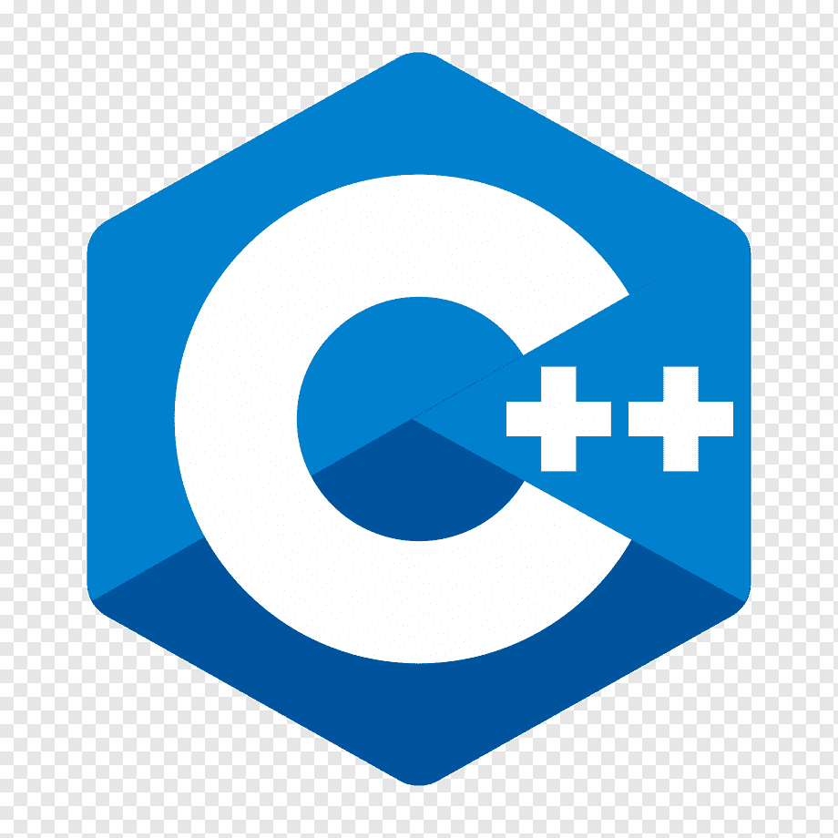
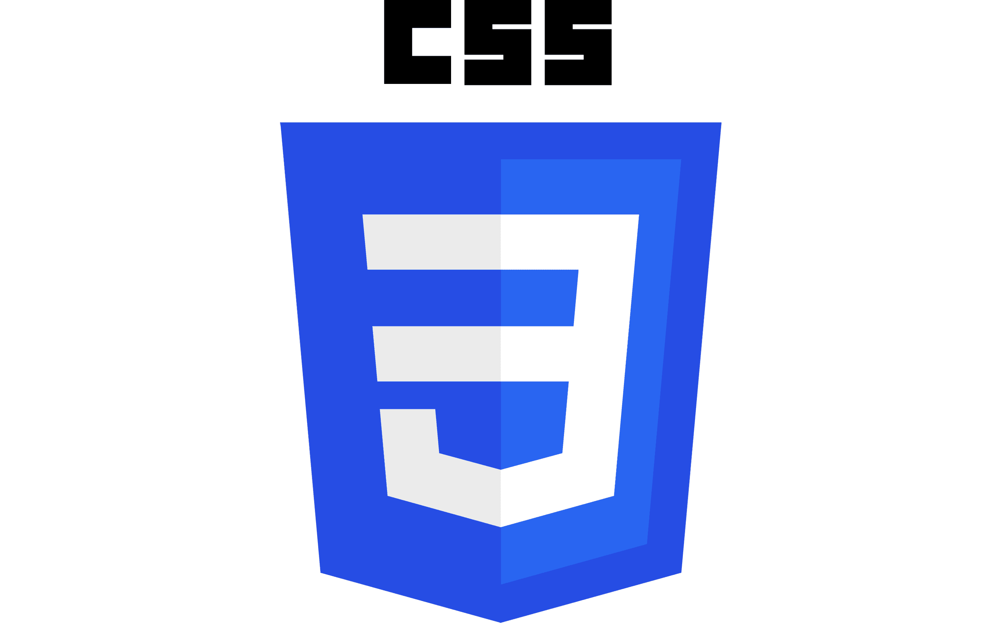
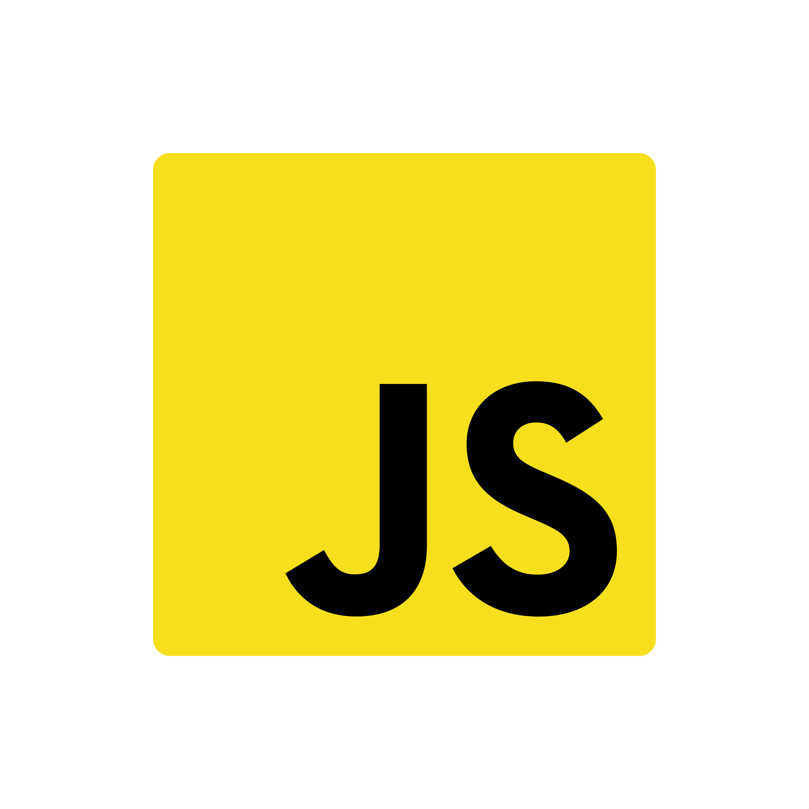

<h1 align="Center">Hi, i'm uday kumar</h1>

- 👋 Hi, I’m uday kumar 
- 👀 I’m interested in coding
- 🌱 I’m currently learning java , js , php
<!--- 
- 📫 How to reach me ...
- 😄 Pronouns: ...
- ⚡ Fun fact: ...
--->
<!---
udaybscitstudent/udaybscitstudent is a ✨ special ✨ repository because its `README.md` (this file) appears on your GitHub profile.
You can click the Preview link to take a look at your changes.
--->
<h2>My skill</h2>

<h1>connect with me</h1>

